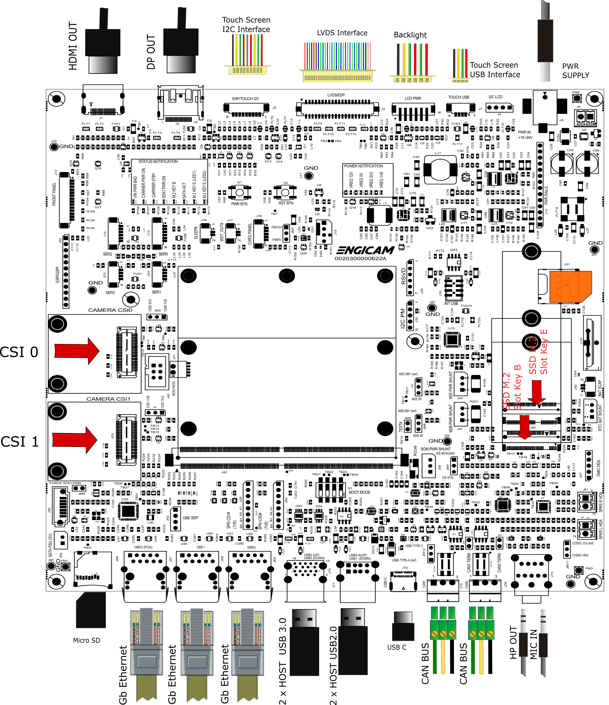
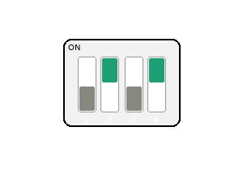
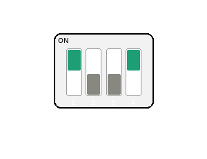

# Test sheet SmarCore Genio 720 Evaluation Board

## Test sheet

## Version: 1.0

## Preliminary

Creation of rity-demo-image image for ufs booting and same image for norboot programming.

## Linux Console

|  Console        | Baud Rate  |
|-----------------|------------|
|  Linux Console  |   921600   |

--------------------------------------------------------------------------------------------------------

## Board Type: Smarcore Evaluation Board

## SOM Type: SmarCore Genio 720



--------------------------------------------------------------------------------------------------------

## U-boot tests

|                                       Test                    | Status  |
|---------------------------------------------------------------|---------|
| [UFS Enviroment saving](#ufs-environment-saving)              |   OK    |
| [NORBOOT Enviroment saving](#norboot-environment-saving)      |   OK    |
| [Ethernet](#ethernet)                                         |   TBT   |
| [Boot from UFS](#boot-from-ufs)                               |   OK    |
| [Boot from NORBOOT](#boot-from-norboot)                       |   OK    |
| [Serial Download](#serial-download)                           |   OK    |

## Test Notes:

### UFS Environment saving

```bash
setenv serverip 192.168.2.93
saveenv                     
    Saving Environment to scsi... Writing to SCSI device(1)... OK
reset board
printenv serverip
```

### NORBOOT environment saving

```bash
setenv serverip 192.168.2.93
saveenv
    Saving Environment to SPIFlash... Erasing SPI flash...Writing to SPI flash...done
reset board
printenv serverip
```

### Boot from UFS




### Boot from NORBOOT



### Serial Download

Close switch 4 to enable serial download. Connect
the board with the source machine (i.e. the machine you are
downloading the images from) by using the board's OTG header (N/A).

Power on the board.


```
genio-flash -i rity-demo-image
```


--------------------------------------------------------------------------------------------------------

## Kernel Linux tests

| Status |              Test             | Note
|:------:|:-----------------------------:|--------------------------------
|   OK   |        Ethernet (J69)         | see [note1](#note-1)
|   OK   |          USB 2.0 (J71)        | tested with USB stick
|   OK   |          USB 3.0 (J70)        | tested with USB stick 
|   OK   |            SDCARD             | see [note2](#note-2)
|   OK   |          UART 232 (J14)       | see [note3](#note-3)
|   OK   |          UART 232 (J23)       | see [note4](#note-4)
|   OK   |          UART 232 (J24)       | see [note5](#note-5)
|   OK   |         Linux Console (J15)   |
|   OK   |              WIFI             | see [note6](#note-6)
|   OK   |           BLUETOOTH           | see [note7](#note-7)
|   OK   |              RTC              | see [note8](#note-8)
|   OK   |            Reboot             |
|   OK   |          DSI TO LVDS          | 
|   OK   |           Backlight           | see [note9](#note-9)
|   OK   |          Touchscreen          | see [note10](#note-10)
|   N/A  |             HDMI              |
|   OK   |             Audio             | see [note11](#note-11)
|   N/A  |       CAN 0/CAN 1 (J75-J76)   | 
|   N/A  |     M.2 Key E PCIe (Wifi/BT)  | 
|   OK   |     M.2 Key B PCIe (J52)      | see [note12](#note-12)
|   OK   |     MIPI-CSI (Camera CSI0)    | see [note13](#note-13)
|   OK   |     MIPI-CSI (Camera CSI1)    | see [note14](#note-14)
|   OK   |           USB-C               | see [note15](#note-15)


--------------------------------------------------------------------------------------------------------

## Note

### Note 1

Connect board's ethernet with your machine's one.

On your machine launch iperf3 server by typing:

```bash
iperf3 -s
```

On board launch iperf3 in client mode:

```bash
iperf3 -c 10.24.1.74
```

Using the IP address of your server machine.

Output:

```bash
Connecting to host 10.24.1.74, port 5201
[  5] local 10.24.67.160 port 34174 connected to 10.24.1.74 port 5201
[ ID] Interval           Transfer     Bitrate         Retr  Cwnd
[  5]   0.00-1.00   sec   113 MBytes   950 Mbits/sec   18    229 KBytes       
[  5]   1.00-2.00   sec   112 MBytes   941 Mbits/sec    9    276 KBytes       
[  5]   2.00-3.00   sec   110 MBytes   925 Mbits/sec   88    212 KBytes       
[  5]   3.00-4.00   sec   112 MBytes   942 Mbits/sec   18    219 KBytes       
[  5]   4.00-5.00   sec   111 MBytes   931 Mbits/sec    9    356 KBytes       
[  5]   5.00-6.00   sec   112 MBytes   938 Mbits/sec    9    287 KBytes       
[  5]   6.00-7.00   sec   111 MBytes   931 Mbits/sec    9    262 KBytes       
[  5]   7.00-8.00   sec   111 MBytes   934 Mbits/sec    9    274 KBytes       
[  5]   8.00-9.00   sec   112 MBytes   938 Mbits/sec    9    270 KBytes       
[  5]   9.00-10.01  sec   112 MBytes   927 Mbits/sec    6    344 KBytes    
- - - - - - - - - - - - - - - - - - - - - - - - -
[ ID] Interval           Transfer     Bitrate         Retr
[  5]   0.00-10.01  sec  1.09 GBytes   936 Mbits/sec  184            sender
[  5]   0.00-10.02  sec  1.09 GBytes   934 Mbits/sec                  receiver

iperf Done.
```

### Note 2

```
mmc1: host does not support reading read-only switch, assuming write-enable
mmc1: new high speed SDHC card at address 2145
mmcblk1: mmc1:2145  29.1 GiB
 mmcblk1: p1 p2 
```


### Note 3

Connect TX/RX PIN connector J14 to the UART 232 port From terminal launch command:

```
stty -F /dev/ttyS3 115200 cs8 -cstopb -parenb raw
cat /dev/ttyS3 &
echo "test" > /dev/ttyS3
```

### Note 4

Connect TX/RX PIN connector J23 to the UART 232 port From terminal launch command:

```
stty -F /dev/ttyS2 115200 cs8 -cstopb -parenb raw
cat /dev/ttyS2 &
echo "test" > /dev/ttyS2
```

### Note 5

Connect TX/RX PIN connector J24 to the UART 232 port From terminal launch command:

```
stty -F /dev/ttyS1 115200 cs8 -cstopb -parenb raw
cat /dev/ttyS1 &
echo "test" > /dev/ttyS1
```

### Note 6

```
ifconfig wlan0 up
iw dev wlan0 scan | grep SSID
wpa_passphrase SSID PASSWORD > /etc/wpa_supplicant.conf
wpa_supplicant -iwlan0 -Dnl80211 -c/etc/wpa_supplicant.conf -B
udhcpc -iwlan0
```

###  Note 7

```
echo "1" > /sys/kernel/debug/ieee80211/phy0/cc33xx/ble_enable
hciconfig -a
hciconfig hci0 up
hciconfig -a
hciconfig hci0 up
[bluetooth]# scan on
```

### Note 8

Set a time and date to the clock:

```
date -s "2026-08-20 11:35:00"
hwclock -w -f /dev/rtc0
```

Turn off the system and power it back on. Once it booted check that the date is the same:

```
hwclock -r -f /dev/rtc0
```

### Note 9

Tested with command:

```
echo <n> > /sys/class/backlight/backlight-lcd0/brightness
```

where n is an integer from 0 to 1023

## Note 10

Tested with command:

```
evtest /dev/input/event3
```

## Note 11

Capture:

```
amixer -c 0 cset name='UL1_CH1 I2SIN0_CH1' 1
amixer -c 0 cset name='UL1_CH2 I2SIN0_CH2' 1
amixer -c 0 cset name='I2S_IN0_Mux' 1
amixer -c 0 cset name='Mic Volume' 3
amixer -c 0 cset name='Capture Switch' 1

arecord -D hw:0,3 -c 2 -f S32_LE -r 48000 -d 5 /tmp/test.wav
aplay -D hw:0,1 -c 2 -f S32_LE -r 48000 /tmp/test.wav
```

Play:

```
amixer -c 0 cset name='I2SOUT0_CH1 DL1_CH1' 1
amixer -c 0 cset name='I2SOUT0_CH2 DL1_CH2' 1
amixer -c 0 cset name='I2S_OUT0_Mux' 1
amixer -c 0 cset name='Headphone Playback Switch' 1

aplay -D hw:0,1 /usr/share/sounds/alsa/Rear_Left.wav
```

## Note 12

```
lspci
00:00.0 PCI bridge: MEDIATEK Corp. Device 8189 (rev 01)
01:00.0 Non-Volatile memory controller: Transcend Information, Inc. NVMe PCIe SSD 110S/112S/120S/MTE300S/MTE400S/MTE652T2 (DRAM-less) (rev 03)
```

## Note 13

```
export MEDIA_DEV=$(v4l2-ctl -z platform:$(basename `find /sys/bus/platform/devices/ -name "*seninf-top"`) --list-devices | grep media)

declare -a VIDEO_DEV=($(for i in `find /sys/bus/platform/devices/ -name "*camsv*" | sort`; do media-ctl -d ${MEDIA_DEV} --entity "`basename $i` video stream" ; done))

media-ctl -d ${MEDIA_DEV} -l "'ov5640 7-003c':0 -> 'seninf-0':0 [1]"
media-ctl -d ${MEDIA_DEV} -l "'seninf-0':1 -> '1a092000.camsv2':0 [1]"
media-ctl -d ${MEDIA_DEV} -V "'ov5640 7-003c':0 [fmt:YUYV8_1X16/1920x1080 field:none]"
media-ctl -d ${MEDIA_DEV} -V "'seninf-0':1 [fmt:YUYV8_1X16/1920x1080 field:none]"
media-ctl -d ${MEDIA_DEV} -V "'1a092000.camsv2':1 [fmt:YUYV8_1X16/1920x1080 field:none]"

gst-launch-1.0 v4l2src device=${VIDEO_DEV[0]} ! video/x-raw,width=1920,height=1080,format=YUY2 ! v4l2convert output-io-mode=dmabuf-import ! video/x-raw,width=1280,height=720 ! fpsdisplaysink video-sink=waylandsink sync=false
```

## Note 14

```
export MEDIA_DEV=$(v4l2-ctl -z platform:$(basename `find /sys/bus/platform/devices/ -name "*seninf-top"`) --list-devices | grep media)

declare -a VIDEO_DEV=($(for i in `find /sys/bus/platform/devices/ -name "*camsv*" | sort`; do media-ctl -d ${MEDIA_DEV} --entity "`basename $i` video stream" ; done))

media-ctl -d ${MEDIA_DEV} -l "'ov5640 8-003c':0 -> 'seninf-1':0 [1]"
media-ctl -d ${MEDIA_DEV} -l "'seninf-1':1 -> '1a093000.camsv3':0 [1]"
media-ctl -d ${MEDIA_DEV} -V "'ov5640 8-003c':0 [fmt:YUYV8_1X16/1920x1080 field:none]"
media-ctl -d ${MEDIA_DEV} -V "'seninf-1':1 [fmt:YUYV8_1X16/1920x1080 field:none]"
media-ctl -d ${MEDIA_DEV} -V "'1a093000.camsv3':1 [fmt:YUYV8_1X16/1920x1080 field:none]"

gst-launch-1.0 v4l2src device=${VIDEO_DEV[1]} ! video/x-raw,width=1920,height=1080,format=YUY2 ! v4l2convert output-io-mode=dmabuf-import ! video/x-raw,width=1280,height=720 ! fpsdisplaysink video-sink=waylandsink sync=false
```

## Note 15

Close connector JM12 in TYPE-C

HOST: use usb-c hub with usb stick 

```
[  497.022144] usb 1-1.3: new high-speed USB device number 7 using xhci-mtk
[  497.147629] usb-storage 1-1.3:1.0: USB Mass Storage device detected
[  497.149571] scsi host1: usb-storage 1-1.3:1.0
[  498.175010] scsi 1:0:0:0: Direct-Access     Intenso  Rainbow Line     5.20 PQ: 0 ANSI: 2
[  498.180403] sd 1:0:0:0: [sdd] 30720000 512-byte logical blocks: (15.7 GB/14.6 GiB)
[  498.182680] sd 1:0:0:0: [sdd] Write Protect is off
[  498.183900] sd 1:0:0:0: [sdd] No Caching mode page found
[  498.184589] sd 1:0:0:0: [sdd] Assuming drive cache: write through
[  498.203746]  sdd: sdd1 sdd2 sdd3 sdd4                      
[  498.204893] sd 1:0:0:0: [sdd] Attached SCSI removable disk 
```

DEVICE: use ethernet gadget with mediatek

```
usb0: flags=4163<UP,BROADCAST,RUNNING,MULTICAST>  mtu 1500                              
        inet 192.168.96.1  netmask 255.255.255.0  broadcast 192.168.96.255
        inet6 fe80::a4d9:45a6:4554:f54  prefixlen 64  scopeid 0x20<link>
        ether 0a:c7:0d:37:1e:23  txqueuelen 1000  (Ethernet)       
        RX packets 123  bytes 13919 (13.5 KiB)                     
        RX errors 0  dropped 0  overruns 0  frame 0                
        TX packets 174  bytes 27768 (27.1 KiB)                     
        TX errors 0  dropped 0 overruns 0  carrier 0  collisions 0

PC HOST:

ping -c 5 192.168.96.1
PING 192.168.96.1 (192.168.96.1) 56(84) bytes of data.
64 bytes from 192.168.96.1: icmp_seq=1 ttl=64 time=0.250 ms
64 bytes from 192.168.96.1: icmp_seq=2 ttl=64 time=0.293 ms
64 bytes from 192.168.96.1: icmp_seq=3 ttl=64 time=0.246 ms
64 bytes from 192.168.96.1: icmp_seq=4 ttl=64 time=0.301 ms
64 bytes from 192.168.96.1: icmp_seq=5 ttl=64 time=0.241 ms

--- 192.168.96.1 ping statistics ---
5 packets transmitted, 5 received, 0% packet loss, time 4107ms
rtt min/avg/max/mdev = 0.241/0.266/0.301/0.025 ms
```

